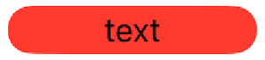
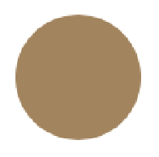
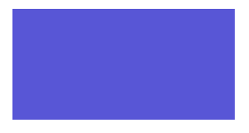
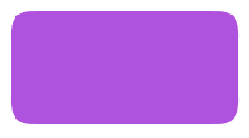
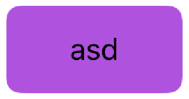
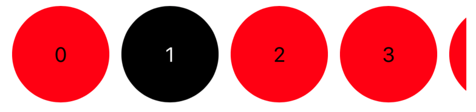

# SwiftEssentialsKit/UI

This module includes the TimeAgo function and a RelativeTimeLabel.

## Usage

### Controllers

#### DatePickerController

```swift
import SwiftEssentialsKit

let controller = DatePickerController.instantiate(current: Date(), start: Date(), end: Date())
present(controller, animated: true)

// Note: to customize selection color, assign a value of `UIWindow.appearance().tintColor`
```

#### NibLoadableView

```swift
ìmport SwiftEssentialsKit

class YourView: UIView, NibLoadableView {
    static var nib: UINib UINib(nibName: "YourView-nibName", bundle: Bundle(for: YourView.swift))
}

YourView.instantiate() // With NibLoadableView, you can instantiate your view from dot notation.
```

### Misc

#### Date+TimeAgo
```swift
import SwiftEssentialsKit

let date = Date() // => Example: "12/03/2020 23:40:23"
date.timeAgo() // => "Just now"
```

#### UIViewController convenient functions

```swift
ìmport SwiftEssentialsKit

class YourController: UIViewController {
    func yourFunction() {
        presentAutomatically(NextController.instantiate()) // Automatically presenting NextController, handling if it is a UINavigationController or it has a navigationController.
        dismissAutomatically() // Automatically dismissing this view controller
    }
}
```

### Views

#### AvatarView


```swift
import SwiftEssentialsKit

// You can use it in a storyboard as well.
// Add a UIView and define its class as AvatarView.
let avatarView = AvatarView()
avatarView.initials = "ADF"
avatarView.color = .red
avatarView.fontSize = 15
```

#### CapsuleLabelView


```swift
import SwiftEssentialsKit

// You can use it in a storyboard as well.
// Add a UIView and define its class as CapsuleLabelView.
let capsuleLabelView = CapsuleLabelView()
capsuleLabelView.text = "text"
capsuleLabelView.textColor = .black
capsuleLabelView.color = .red
```

#### CapsuleView


```swift
import SwiftEssentialsKit

// You can use it in a storyboard as well.
// Add a UIView and define its class as CapsuleView.
let capsuleView = CapsuleView()
capsuleView.color = .orange
```

#### CircleLabelView


```swift
import SwiftEssentialsKit

// You can use it in a storyboard as well.
// Add a UIView and define its class as CircleLabelView.
let circleLabelView = CircleLabelView()
circleLabelView.text = "text"
circleLabelView.textColor = .black
circleLabelView.color = .red
```

#### CircleLabel


```swift
import SwiftEssentialsKit

// You can use it in a storyboard as well.
// Add a UIView and define its class as CircleLabel.
let circleLabel = CircleLabel()
circleLabel.color = .orange
```

#### CloseBarButtonItem

```swift
import SwiftEssentialsKit

let closeButton = CloseBarButtonItem(target: self, action: #selector(yourFunction)) 
```

#### RectangleView




```swift
import SwiftEssentialsKit

// You can use it in a storyboard as well.
// Add a UIView and define its class as RectangleView.
let rectangleView = RectangleView()
rectangleView.color = .blue
rectangleView.cornerRadius = 8
```

#### RectangleLabelView



```swift
import SwiftEssentialsKit

// You can use it in a storyboard as well.
// Add a UIView and define its class as RectangleLabelView.
let rectangleView = RectangleLabelView()
rectangleView.color = .blue
rectangleView.text = "text"
rectangleView.cornerRadius = 8
```

#### RelativeTimeLabel

```swift
import SwiftEssentialsKit

// You can use it in a storyboard as well.
// Add a UILabel and define its class as RelativeTimeLabel.
let relativeTimeLabel = RelativeTimeLabel()
relativeTimeLabel.referenceDate = Date()
```

#### DividerView

```swift
import SwiftEssentialsKit

// You can use it in a storyboard as well.
// Add a UIView and define its class as DividerView.
let dividerView = DividerView()
dividerView.position = .bottom
```

#### HorizontalSelectionView



HorizontalSelectionView uses a UICollectionView to show elements in a single horizontal section.

Here an example for using HorizontalSelectionView.

```swift
import SwiftEssentialsKit

class ExampleController: UIViewController {
    // In storyboard: Add a UIView and define its class as HorizontalSelectionView.
    @IBOutlet weak var horizontalSelectionView: HorizontalSelectionView!
    
    override func viewDidLoad() {
        super.viewDidLoad()
        
        horizontalSelectionView.delegate = self
        horizontalSelectionView.dataSource = self
        
        // YOU MUST REGISTER A CELL.
        horizontalSelectionView.register(ExampleCell.self)
    }
}
```

Define a cell for HorizontalSelectionView extending HorizontalSelectionViewCell. 
A HorizontalSelectionView is a UICollectionViewCell, so in its associated nib you should add an UICollectionViewCell.

```swift
import SwiftEssentialsKit

class ExampleCell: HorizontalSelectionViewCell {
    static let identifier: String = "HorizontalViewCell"
    static let nib: UINib = UINib(nibName: "HorizontalViewCell", bundle: Bundle.main)
    
    @IBOutlet weak var capsuleLabelView: CapsuleLabelView!
}
```

Then implement `HorizontalSelectionViewDelegate` and `HorizontalSelectionViewDataSource`.

```swift
extension ViewsViewController: HorizontalSelectionViewDelegate, HorizontalSelectionViewDataSource {
    func numberOfItems(in horizontalSelectionView: HorizontalSelectionView) -> Int {
        return 10 // Return here the number of elements
    }
    
    func horizontalSelectionView(_ horizontalSelectionView: HorizontalSelectionView, cell: HorizontalSelectionViewCell, atPosition position: Int) {
        let cell = cell as! ExampleCell // Case the cell with your type cell (in the example: ExampleCell)
        
        // Bind data with your GUI elements cell.
        cell.capsuleLabelView.text = position.asString
        
        // Here you should handle the user selection. 
        if cell.isSelected {
            cell.capsuleLabelView.color = .black
            cell.capsuleLabelView.textColor = .white
        } else {
            cell.capsuleLabelView.color = .red
            cell.capsuleLabelView.textColor = .black
        }
    }
}
```
